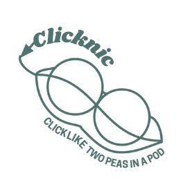

<div id="top"></div>

<!-- PROJECT LOGO -->
<br />
<div align="center">
  <a href="https://github.com/allenNyela/Pearl_Hacks_2022_Project">
    
  </a>

  <h3 align="center">Clicknic: Two Peas in a Pod</h3>

  <p align="center">
    A web app that allows you to make new friends through virtual picnics!
    <br />
    <a href="https://github.com/allenNyela/Pearl_Hacks_2022_Project"><strong>Explore the docs »</strong></a>
    <br />
    <br />
    <a href="https://github.com/allenNyela/Pearl_Hacks_2022_Project">View Demo (change link)</a>
    ·
    <a href="https://github.com/allenNyela/Pearl_Hacks_2022_Project/issues">Report Bug</a>
    ·
    <a href="https://github.com/allenNyela/Pearl_Hacks_2022_Project/issues">Request Feature</a>
  </p>
</div>

<!-- TABLE OF CONTENTS -->
<details>
  <summary>Table of Contents</summary>
  <ol>
    <li>
      <a href="#about-the-project">About The Project</a>
      <ul>
        <li><a href="#built-with">Built With</a></li>
      </ul>
    </li>
    <li>
      <a href="#getting-started">Getting Started</a>
      <ul>
        <li><a href="#installation">Installation</a></li>
      </ul>
    </li>
    <li><a href="#usage">Usage</a></li>
    <li><a href="#contributing">Contributing</a></li>
    <li><a href="#contact">Contact</a></li>
    <li><a href="#acknowledgments">Acknowledgments</a></li>
  </ol>
</details>


<!-- ABOUT THE PROJECT -->
## About The Project

Clicknic: Two Peas in a Pod is a web app designed in order to bring people together through virtual picnicking. Users can create profiles, find and chat with other picnickers, and easily set up a virtual picnic appointment. Picnics are held over a phone call. Users can send pictures of their food and picknicking setups through the web app.

<p align="right">(<a href="#top">back to top</a>)</p>

### Built With

Here are the main languages and tools that we used for this project.

* [Flask](https://flask.palletsprojects.com/en/2.0.x/)
* [Python](https://www.python.org)
* [HTML](https://html.com)
* [CSS](https://www.w3.org/Style/CSS/Overview.en.html)

<p align="right">(<a href="#top">back to top</a>)</p>

<!-- GETTING STARTED -->
## Getting Started

Follow these instructions to run the web app code locally! If you just want to view and interact with the web app, just go to these links in your browser:

(put links here)

### Installation

_Below is an example of how you can instruct your audience on installing and setting up your app. This template doesn't rely on any external dependencies or services._

1. Clone the repo
   ```sh
   git clone https://github.com/allenNyela/Pearl_Hacks_2022_Project.git
   ```
2. Navigate to the folder
   ```sh
   cd Pearl_Hacks_2022_Project
   ```
3. Run install.sh by dragging the file into your terminal.

4. Run the following command:
   ```sh
   python3 app.py
   ```
5. Type "localhost:5000" into your browser's URL bar and press enter.


<p align="right">(<a href="#top">back to top</a>)</p>


<!-- USAGE EXAMPLES -->
## Usage

View our demo video here: link

<p align="right">(<a href="#top">back to top</a>)</p>


<!-- CONTRIBUTING -->
## Contributing

Contributions are what make the open source community such an amazing place to learn, inspire, and create. Any contributions you make are **greatly appreciated**.

If you have a suggestion that would make this better, please fork the repo and create a pull request.
Don't forget to give the project a star! Thanks again!

1. Fork the Project
2. Create your Feature Branch (`git checkout -b feature/AmazingFeature`)
3. Commit your Changes (`git commit -m 'Add some AmazingFeature'`)
4. Push to the Branch (`git push origin feature/AmazingFeature`)
5. Open a Pull Request

<p align="right">(<a href="#top">back to top</a>)</p>


<!-- CONTACT -->
## Contact

Abby Nacional - [@abigailnacional](https://github.com/abigailnacional) - abigailnacional@gmail.com

Nyela Allen - [@allenNyela](https://github.com/allenNyela) - nmallen3@ncsu.edu

Tiffany - tiffanytruong1017@gmail.com

Olivia Carson - [@ocarson10](https://github.com/ocarson10) - ocarson123101@gmail.com

Project Link: [https://github.com/allenNyela/Pearl_Hacks_2022_Project](https://github.com/allenNyela/Pearl_Hacks_2022_Project)

<p align="right">(<a href="#top">back to top</a>)</p>


<!-- ACKNOWLEDGMENTS -->
## Acknowledgments

Thank you to the directors, mentors, and sponsors of PearlHacks 2022!

<p align="right">(<a href="#top">back to top</a>)</p>


